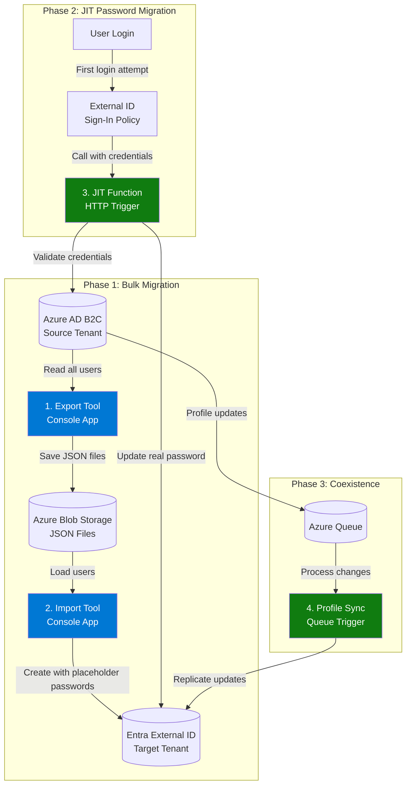

# Azure AD B2C to Entra External ID Migration Kit

> **⚠️ PREVIEW/SAMPLE STATUS**  
> This is a **sample implementation** showcasing the [Just-In-Time password migration public preview](https://learn.microsoft.com/entra/external-id/customers/how-to-migrate-passwords-just-in-time). **NOT PRODUCTION-READY**. See [roadmap](#-next-steps-and-future-enhancements) for planned features.

A toolkit for migrating users from Azure AD B2C to Microsoft Entra External ID with minimal downtime and seamless password migration through Just-In-Time (JIT) authentication.

## 🎯 Overview

This migration kit provides a sample solution for identity migration with:

- ✅ **Bulk Export/Import** - Efficient batch processing with retry logic and throttling management
- ✅ **Just-In-Time (JIT) Password Migration** - Seamless password migration on user's first login
- ✅ **Full Observability** - Application Insights integration with metrics and dashboards

## 🏗️ Architecture

**Key Components:**

1. **B2CMigrationKit.Console** - CLI tool for export/import operations
2. **B2CMigrationKit.Function** - Azure Function for JIT password migration
3. **B2CMigrationKit.Core** - Shared business logic and services

## Migration Flow

---

## 🔑 Key Features

### ✅ Currently Available

- **Bulk User Export** from Azure AD B2C with automatic pagination
- **Bulk User Import** to External ID with extension attributes
- **JIT Password Migration** via Custom Authentication Extension
- **UPN Domain Transformation** preserving local-part identifiers as a workaround to enable [sign-in alias](https://learn.microsoft.com/en-us/entra/external-id/customers/how-to-sign-in-alias) functionality 
- **Attribute Mapping** with flexible field transformation
- **Export Filtering** by display name pattern and user count limits
- **Built-in Retry Logic** with exponential backoff
- **Comprehensive Telemetry** with Application Insights integration
- **Local Development Mode** using Azurite emulator (no Azure resources)
- **Multi-Instance Scaling** for high-volume migrations
  
> **⚠️ PREVIEW/SAMPLE STATUS**: This toolkit is currently a **sample implementation** to showcase how to implement the [Just-In-Time password migration public preview](https://learn.microsoft.com/en-us/entra/external-id/customers/how-to-migrate-passwords-just-in-time?tabs=graph) for export, import and JIT function. Production-ready features including full SFI compliance (Private Endpoints, VNet integration, automated infrastructure deployment) are planned for future releases. 

## 📚 Documentation

This migration kit includes two comprehensive guides:

### [Architecture Guide](docs/ARCHITECTURE_GUIDE.md)
Complete architectural overview for solutions architects, technical leads, and security reviewers:
- Executive summary and system design
- Component architecture (Export, Import, JIT, Profile Sync)
- Security architecture and compliance patterns
- Scalability, performance benchmarks, and multi-instance deployments
- Deployment topologies and operational considerations
- Cost optimization strategies

**Target Audience:** Solutions Architects, Technical Leads, Security Reviewers

### [Developer Guide](docs/DEVELOPER_GUIDE.md)
Complete technical reference for developers implementing and operating the migration:
- Project structure and configuration guide
- Development workflow and local setup
- JIT (Just-In-Time) migration implementation with RSA keys and Custom Authentication Extensions
- Attribute mapping configuration and UPN transformation
- Import audit logs for compliance tracking
- Scaling for high-volume migrations (>100K users)
- Operations, monitoring with Application Insights, and troubleshooting
- Security best practices and deployment procedures

**Target Audience:** Developers, DevOps Engineers, Operations Teams

## 🚀 Next Steps and Future Enhancements

This repository currently focuses on exemplifying the implementation of the [Just-In-Time password migration public preview](https://learn.microsoft.com/en-us/entra/external-id/customers/how-to-migrate-passwords-just-in-time?tabs=graph). Future enhancements will include:

- **Automated Infrastructure Deployment**: Alignment with Secure Future Initiative (SFI) standards through automated deployment templates (Bicep/Terraform)
- **Production-Ready Security**: Full integration with Private Endpoints, VNet integration, and Managed Identity
- **Profile Synchronization**: Queue-based bidirectional sync during coexistence phase

These features are planned for upcoming releases to provide a complete enterprise-grade migration solution.

## 📊 Telemetry

This project uses Application Insights to collect telemetry data for monitoring and diagnostics. Telemetry collection is optional and can be controlled via configuration:

- To **enable telemetry**: Set `Telemetry:Enabled` to `true` and provide an Application Insights connection string in `appsettings.json`
- To **disable telemetry**: Set `Telemetry:Enabled` to `false` in your configuration

For local development, telemetry is disabled by default. See the [Developer Guide](docs/DEVELOPER_GUIDE.md#telemetry-configuration) for detailed configuration options.

**Privacy Note**: When telemetry is enabled, Microsoft may collect information about your use of the software. The data collected helps improve the quality and reliability of the software. For more information about Microsoft's privacy practices, please see the [Microsoft Privacy Statement](https://privacy.microsoft.com/privacystatement).

## 🤝 Contributing

We welcome contributions! Please see our [Contributing Guide](CONTRIBUTING.md) for details on:
- How to set up your development environment
- Coding standards and best practices
- Submitting pull requests
- Reporting issues

## 🔒 Security

Security is a top priority. If you discover a security vulnerability, please follow our [Security Policy](SECURITY.md) for responsible disclosure.

## 💬 Support

For questions, issues, or discussions, please see our [Support Guide](SUPPORT.md).

## Code of Conduct

This project has adopted the [Microsoft Open Source Code of Conduct](https://opensource.microsoft.com/codeofconduct/). For more information see the [Code of Conduct FAQ](https://opensource.microsoft.com/codeofconduct/faq/) or contact [opencode@microsoft.com](mailto:opencode@microsoft.com) with any additional questions or comments.

## 📄 License

This project is licensed under the MIT License - see the [LICENSE](LICENSE) file for details.

## ™️ Trademarks

This project may contain trademarks or logos for projects, products, or services. Authorized use of Microsoft trademarks or logos is subject to and must follow [Microsoft's Trademark & Brand Guidelines](https://www.microsoft.com/legal/intellectualproperty/trademarks/usage/general). Use of Microsoft trademarks or logos in modified versions of this project must not cause confusion or imply Microsoft sponsorship. Any use of third-party trademarks or logos are subject to those third-party's policies.

