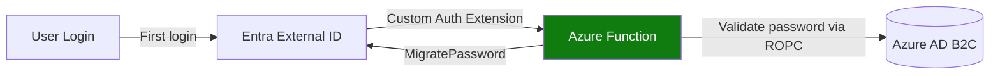

# Azure AD B2C to Entra External ID Migration Kit

[](https://opensource.org/licenses/MIT)
[](https://dotnet.microsoft.com/download)
[](https://github.com/PowerShell/PowerShell)
[](CONTRIBUTING.md)

> **⚠️ PREVIEW/SAMPLE** — Sample implementation of the [JIT password migration mechanism](https://learn.microsoft.com/entra/external-id/customers/how-to-migrate-passwords-just-in-time).

Migrate users from Azure AD B2C to Microsoft Entra External ID with bulk user export/import and seamless password migration on first login (JIT).

## 🤖 Use with GitHub Copilot

This repo includes a [Copilot skill](.github/skills/b2c-migration/SKILL.md) — open the repo in VS Code and ask Copilot to guide you step by step:

- *"Set up B2C migration for my tenant"*
- *"Run the export/import in Simple Mode"*
- *"Configure JIT password migration"*
- *"Deploy migration workers to Azure"*
- *"Migrate my B2C app MyWebApp to External ID"*
- *"Transform my B2C API connectors to External ID CAE"*

The skill covers the full workflow: setup, bulk migration, JIT configuration, local testing, deployment, monitoring, and **app & API connector migration**.

### App & Connector Migration (Copilot-guided)

Migrate individual B2C apps and their API connectors to External ID with a single command. The Copilot skill guides you through the process interactively — just tell it which app you want to migrate:

```
"I want to migrate my B2C app to External ID"
```

Or run directly:
```powershell
.\scripts\Migrate-B2CApp.ps1 `
    -B2CTenantId "contosob2c.onmicrosoft.com" `
    -EeidTenantId "contosoeeid.onmicrosoft.com" `
    -AppName "MyWebApp" `
    -ConnectorNames "MyApp*" `
    -ClaimsForToken "role","department"
```

The script exports the app from B2C, re-creates it in External ID, transforms API connectors into `onTokenIssuanceStart` Custom Authentication Extensions (CAE), and prints a clear report of what was automated, what needs manual action, and what could not be migrated.

## ⚡ Quick Start

**Option A — Interactive wizard** (recommended):
```powershell
.\scripts\Setup-Migration.ps1
```

**Option B — Manual setup**: See the [Runbook](docs/RUNBOOK.md) for step-by-step instructions.

**Prerequisites:** .NET 8.0 SDK, PowerShell 7+, Azure CLI, VS Code with Azurite extension.

## Migration Modes

| | **Simple Mode** | **Advanced Mode** |
|---|---|---|
| **Steps** | `export` → `import` | `harvest` → `worker-migrate` + `phone-registration` |
| **Best for** | < 1M users, no MFA phones | Large tenants, MFA phone migration |
| **Infra** | Local files only | Azure Queue Storage |
| **Parallelism** | Single process | N workers |

Both modes create users with random passwords + `RequireMigration` flag. **JIT password migration** (Azure Function) handles the real password on each user's first login:


```mermaid
graph LR
    User[User Login] -->|First login| ExtID[Entra External ID]
    ExtID -->|Custom Auth Extension| JIT[Azure Function]
    JIT -->|Validate password via ROPC| B2C[(Azure AD B2C)]
    JIT -->|MigratePassword| ExtID
    style JIT fill:#107c10,color:#fff
```

## Key Features

- **Two bulk migration modes** — Simple (export/import) or Advanced (queue-based parallel workers)
- **JIT password migration** — seamless first-login password transfer via Custom Authentication Extension
- **MFA phone registration** — migrate phone numbers at throttle-safe rates (Advanced Mode)
- **App & connector migration** — export B2C app registrations and transform API connectors to CAEs
- **Audit trail** — every operation tracked in local JSONL or Azure Table Storage
- **Local dev mode** — runs entirely on your machine with Azurite (no Azure resources needed)

## 📚 Documentation

| Guide | For | Covers |
|-------|-----|--------|
| [Architecture Guide](docs/ARCHITECTURE_GUIDE.md) | Architects, Tech Leads | System design, security, scalability, deployment topologies |
| [Developer Guide](docs/DEVELOPER_GUIDE.md) | Developers, DevOps | Configuration, local setup, JIT implementation, troubleshooting |
| [Runbook](docs/RUNBOOK.md) | Operations | Step-by-step setup and deployment |
| [Scripts Reference](scripts/README.md) | Everyone | All available scripts with examples |

## 🤝 Contributing

We welcome contributions! See our [Contributing Guide](CONTRIBUTING.md) for details.

## 🔒 Security

If you discover a vulnerability, please follow our [Security Policy](SECURITY.md) for responsible disclosure.

## 💬 Support

For questions, issues, or discussions, please see our [Support Guide](SUPPORT.md).

## Code of Conduct

This project has adopted the [Microsoft Open Source Code of Conduct](https://opensource.microsoft.com/codeofconduct/). For more information see the [Code of Conduct FAQ](https://opensource.microsoft.com/codeofconduct/faq/) or contact [opencode@microsoft.com](mailto:opencode@microsoft.com) with any additional questions or comments.

## 📄 License

This project is licensed under the MIT License - see the [LICENSE](LICENSE) file for details.

## ™️ Trademarks

This project may contain trademarks or logos for projects, products, or services. Authorized use of Microsoft trademarks or logos is subject to and must follow [Microsoft's Trademark & Brand Guidelines](https://www.microsoft.com/legal/intellectualproperty/trademarks/usage/general). Use of Microsoft trademarks or logos in modified versions of this project must not cause confusion or imply Microsoft sponsorship. Any use of third-party trademarks or logos are subject to those third-party's policies.


